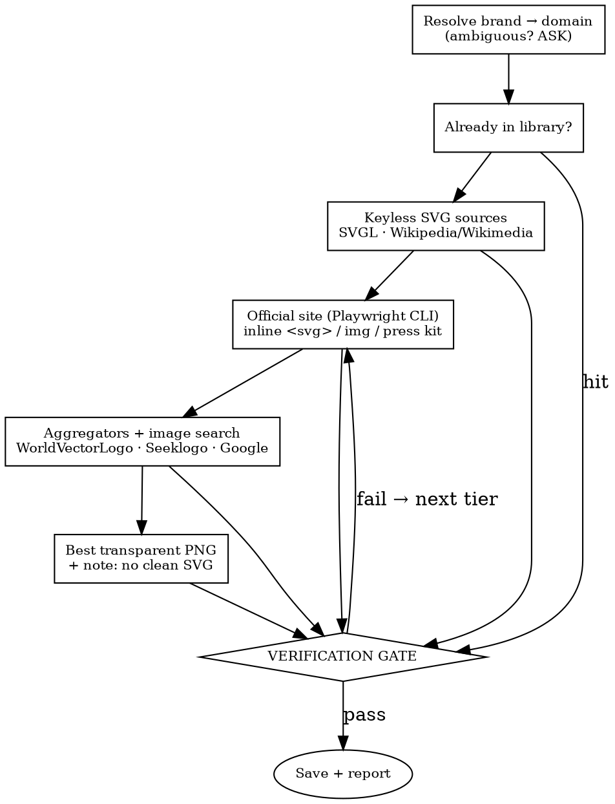

# Find Logo

Find a company's logo and deliver a **verified transparent-background SVG** (preferred) or
**PNG** (fallback), saved into the logo library. Transparency is the non-negotiable output —
**prove it, never assume it** (see `## Verification gate`).

## Library (cache-first)

```
/Users/oliingram/Library/CloudStorage/GoogleDrive-oli@wonderstudios.com/My Drive/assets/logos
```

Always **quote** this path (it has spaces and is Google-Drive-synced). One folder per company:
`<Library>/<Company>/`. **Check the library first** — if a matching file already exists, return
it and skip the web. Filenames: `<company>-primary.svg` by default; variant suffixes `-icon`,
`-wordmark`, `-lockup`, `-white`, `-black`, `-mono`; rasters use `.png`. Write a one-line
`source.txt` (URL · form · date) beside each file.

## Auto light/dark variants (SVG only)

After **every SVG** passes the gate, generate monochrome background variants:

```bash
python3 scripts/make_variants.py "<Library>/<Company>/"
```

Folders are named by the **asset's own color** (not the background); both stay transparent:
`<Company>/light/` = the light-colored (**white**) logo → for dark backgrounds; `<Company>/dark/`
= the dark-colored (**black**) logo → for light backgrounds. Same filenames. Colors are two
constants at the top of the script (`LIGHT_COLOR = #FFF`, `DARK_COLOR = #000`). Geometry is
untouched and **no background is ever added** — only the logo's `fill`/`stroke` change. **PNGs are
skipped.** The recolored files are still real SVGs, so they pass the gate too. See
`references/verify-and-convert.md` for the monochrome caveat (logos built from opaque white
knockout shapes can flatten).

## Defaults (unless the user says otherwise)

- **Form:** primary / most recognizable — judge per brand; mention if other forms exist.
- **Format:** SVG; PNG only if requested, or if nothing vector exists.
- **Dark version:** only when asked (or when the primary would be invisible on a stated background).
- **Autonomy:** auto-deliver the best result; **only stop to ask when genuinely stuck** — an
  ambiguous brand, or when the only way to pass the gate is faking transparency / tracing a raster.

## Waterfall — stop at the first candidate that passes the gate



Exact sources + query commands: `references/sources.md`. Site extraction — including pulling an
**inline `<svg>` straight from the DOM by CSS selector** (`scripts/extract_inline_svg.js` via
`playwright-cli eval --filename`), plus ``/CSS assets and press kits: `references/extraction.md`.
**Browser: prefer Playwright CLI** (under Node v22.17.1 —
`~/.nvm/versions/node/v22.17.1/bin/playwright-cli`, or `nvm use 22`; run headless; its `eval`
command runs in-page JS); the `mcp__playwright__*` / `mcp__chrome-devtools__*` tools are the fallback.

## Verification gate — REQUIRED before you deliver ANY file

Do not claim success until every box is checked. Commands + scripts: `references/verify-and-convert.md`.

- [ ] **Right brand** — the actual company's mark, not a lookalike, placeholder, or related product.
- [ ] **Format** matches the request (SVG default; PNG if requested or only option).
- [ ] **Real vector** (SVG) — not a base64 `<image>` wrapped in `<svg>` → `scripts/check_svg.py`.
- [ ] **Transparent — proven:**
      PNG → `sips -g hasAlpha "<file>"` = yes **and** `scripts/check_image.py` shows corners at
      alpha 0 (catches "white box with an alpha channel").
      SVG → no full-canvas opaque background → `scripts/check_svg.py`.
- [ ] **Resolution** (raster only) — ≥ 1024px on the long edge; reject tiny/blurry.

If a candidate only passes by hacking transparency (`make_transparent.py`) or tracing a raster,
that is a **stuck** moment — flag it to the user, don't silently ship it.

## Report back

Saved path(s) · format · form · `transparent ✓ (how verified)` · source URL · any caveats.
For SVGs, note that `light/` + `dark/` variants were generated (flag the multi-color ⚠ if it fired).
For a **batch** (comma-separated names): run the pipeline per company, save all, then give one
summary table and flag any that needed a compromise.

## Example

`/find-logo Stripe` → SVGL returns a full-color SVG → `check_svg.py`: real vector, no opaque
background → save to `…/assets/logos/Stripe/stripe-primary.svg` → report the path +
"transparent ✓ (SVG, no background rect), source: svgl.app".
