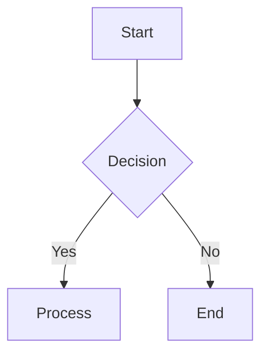
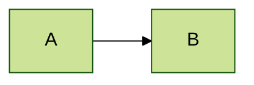

# Notion Importer Skill

Upload markdown files or content to Notion databases/pages with full formatting support.

## Quick Start

```bash
# Upload markdown file to Nyx database (default, with auto TOC)
node /root/clawd/skills/notion-importer/upload.js report.md

# Upload with custom title
node /root/clawd/skills/notion-importer/upload.js report.md --title "My Research"

# Upload to existing page (append)
node /root/clawd/skills/notion-importer/upload.js report.md --page <page_id>

# Replace existing page content
node /root/clawd/skills/notion-importer/upload.js report.md --page <page_id> --replace

# Disable table of contents
node /root/clawd/skills/notion-importer/upload.js report.md --no-toc
```

## Default Database

All uploads go to the **Nyx database** by default:
- **Database ID:** `5df03450-e009-47eb-9440-1bca190f835c`
- **Data Source ID:** `4d050324-79c8-4543-8a42-dac961761b93`

Override with `--database <id>` for other destinations.

## Features

### Table of Contents (Auto-Generated)

**Automatically adds a Notion table of contents block** at the start of documents with 3+ headings.

- **Auto-enabled:** Documents with 3 or more headings get a TOC by default
- **Smart detection:** Only adds TOC when it's useful (enough headings to navigate)
- **Customizable:** Configure minimum heading count or disable entirely
- **Zero config:** Notion automatically generates the TOC from your headings

**How it works:**
1. Parser counts `# Heading 1`, `## Heading 2`, `### Heading 3` in your markdown
2. If count ≥ 3 (configurable), adds `table_of_contents` block at the start
3. Notion renders a clickable navigation menu from your headings

**Control options:**
```bash
# Force TOC even if few headings
node upload.js report.md --toc

# Disable TOC entirely
node upload.js report.md --no-toc

# Require 5+ headings for auto-TOC
node upload.js report.md --toc-min 5
```

### Markdown Support

| Element | Syntax | Notion Block |
|---------|--------|--------------|
| Heading 1 | `# Title` | `heading_1` |
| Heading 2 | `## Title` | `heading_2` |
| Heading 3 | `### Title` | `heading_3` |
| Paragraph | Plain text | `paragraph` |
| Bullet list | `- item` or `* item` | `bulleted_list_item` |
| Numbered list | `1. item` | `numbered_list_item` |
| Checkbox | `- [ ] todo` / `- [x] done` | `to_do` |
| Blockquote | `> quote` | `callout` (💡) |

### Checkboxes (To-Do Blocks)

Markdown checkboxes are converted to Notion's interactive `to_do` blocks:

```markdown
- [ ] Unchecked task
- [x] Checked task (completed)
- [X] Also works with uppercase X
* [ ] Star marker works too
+ [ ] Plus marker also works
```

**Supported formats:**
| Format | Result | Example |
|--------|--------|---------|
| `- [ ] text` | Unchecked | ☐ Task pending |
| `- [x] text` | Checked | ☑ Task complete |
| `- [X] text` | Checked | ☑ Task complete |
| `* [ ] text` | Unchecked | ☐ Using asterisk |
| `+ [ ] text` | Unchecked | ☐ Using plus |

**Note:** The checkbox pattern (`- [ ]` or `- [x]`) must appear at the start of a line. Regular bullet items that happen to contain brackets like `- [some text]` are NOT converted to checkboxes.
| Code block | ` ```lang ` | `code` with syntax highlighting |
| Table | `\| A \| B \|` | `table` (simple table) |
| Divider | `---` | `divider` |
| Bold | `**text**` | Bold annotation |
| Italic | `*text*` or `_text_` | Italic annotation |
| Inline code | `` `code` `` | Code annotation |
| Link | `[text](url)` | Text with link |

### Tables

Markdown tables are converted to Notion simple tables:

```markdown
| Feature | Supported |
|---------|-----------|
| Headers | ✅ Yes |
| Data rows | ✅ Yes |
| Inline formatting | ✅ Yes |
```

### Code Blocks

Full syntax highlighting support:

```markdown
```python
def hello():
    print("Hello, Notion!")
```⁠
```

Supported languages: python, javascript, typescript, shell, bash, json, yaml, html, css, sql, go, rust, ruby, java, c, c++, c#, and many more.

### Mermaid Diagrams

Mermaid diagrams automatically get **dual-mode theming** optimized for dark mode with light mode compatibility:

```markdown

```

**Dual-Mode Theme Features:**

| Element | Color | Purpose |
|---------|-------|---------|
| Node Background | `#60a5fa` (Medium Blue) | Readable on dark mode, visible on light mode |
| Node Text | `#1e293b` (Dark Slate) | High contrast on light backgrounds |
| Node Border | `#2563eb` (Bright Blue) | Clear boundaries in both modes |
| Lines/Arrows | `#6b7280` (Medium Gray) | Visible connections in both modes |
| Notes | `#fde047` / `#713f12` (Yellow/Dark Brown) | High visibility callouts |
| Subgraphs | `#a5b4fc` (Light Indigo) | Subtle grouping visible in both modes |

**Color Palette by Element Type:**

- **Primary (Main nodes):** Medium blue `#60a5fa` with dark slate text `#1e293b`
- **Secondary (Alt nodes):** Medium teal `#34d399` with dark green text `#064e3b`  
- **Tertiary (Highlights):** Bright amber `#fbbf24` with dark brown text `#78350f`
- **Notes:** Vibrant yellow `#fde047` with dark brown text `#713f12`


**Custom Theming:** If you need a different theme, add your own `%%{init: ...}%%` directive and the importer will preserve it:



### Automatic URL Linking

Both markdown-style links and plain text URLs are automatically converted to clickable Notion links:
- Markdown links: `[text](url)` → Linked text
- Plain URLs: `https://example.com` → Auto-linked URL
- WWW URLs: `www.example.com` → Auto-linked as `https://www.example.com`

### Rate Limiting

Built-in rate limiting protects against API throttling:
- Batch uploads: 100 blocks per request
- Delay between batches: 0.4 seconds
- Automatic retry on rate limit errors

## Usage Examples

### 1. Research Report Upload

```bash
# Complete workflow: research → save → upload
# 1. Research creates report at /tmp/research_report.md
# 2. Upload to Notion

node /root/clawd/skills/notion-importer/upload.js \
  /tmp/research_report.md \
  --title "Research: Topic Name" \
  --properties '{"Type":{"select":{"name":"Research"}},"Status":{"select":{"name":"Done"}},"Tags":{"multi_select":[{"name":"research"}]}}'
```

### 2. Task Queue Integration

```bash
# Upload task results to existing task page
PAGE_ID="2f6e334e-6d5f-8060-91f4-ed979d32e712"

node /root/clawd/skills/notion-importer/upload.js \
  /tmp/task_results.md \
  --page $PAGE_ID \
  --replace
```

### 3. Append to Existing Page

```bash
# Add new content without deleting existing
node /root/clawd/skills/notion-importer/upload.js \
  additional_notes.md \
  --page $PAGE_ID
```

### 4. Custom Properties

```bash
# Set any database properties
node /root/clawd/skills/notion-importer/upload.js \
  report.md \
  --title "Weekly Summary" \
  --properties '{
    "Status": {"select": {"name": "Complete"}},
    "Priority": {"select": {"name": "High"}},
    "Tags": {"multi_select": [{"name": "weekly"}, {"name": "summary"}]},
    "Assignee": {"select": {"name": "Nyx"}}
  }'
```

## API Reference

### upload.js

```
Usage: upload.js <file.md> [options]

Options:
  --database <id>     Target database (default: Nyx database)
  --page <id>         Upload to existing page
  --replace           Replace page content (with --page)
  --title <text>      Page title
  --properties <json> Database properties as JSON
  --toc               Force table of contents (auto for 3+ headings)
  --no-toc            Disable table of contents
  --toc-min <num>     Minimum headings for auto-TOC (default: 3)
  --help              Show help
```

## Architecture

```
┌─────────────────────────────────────────────────────────────┐
│                    notion-importer                          │
├─────────────────────────────────────────────────────────────┤
│                                                             │
│  upload.js ─────────────────────────────────────────────┐   │
│    │                                                    │   │
│    ├─► Read markdown file                               │   │
│    │                                                    │   │
│    ├─► markdown-to-notion.js                            │   │
│    │     │                                              │   │
│    │     ├─► Parse headings, lists, code blocks        │   │
│    │     ├─► Convert tables to Notion table blocks     │   │
│    │     ├─► Parse inline formatting (bold, links)     │   │
│    │     └─► Return array of Notion blocks             │   │
│    │                                                    │   │
│    ├─► Create page (if database mode)                   │   │
│    │     └─► Set properties (title, status, tags)      │   │
│    │                                                    │   │
│    ├─► Upload blocks in batches of 100                  │   │
│    │     ├─► Batch 1 → wait 0.4s                       │   │
│    │     ├─► Batch 2 → wait 0.4s                       │   │
│    │     └─► ...                                        │   │
│    │                                                    │   │
│    └─► Return success with URL and block count         │   │
│                                                         │   │
└─────────────────────────────────────────────────────────────┘
```

## Configuration

### API Key Location

```
~/.config/notion/api_key
```

Ensure the Notion integration has access to target databases.

### API Version

**Always uses:** `2022-06-28` (stable)

⚠️ Do NOT use newer versions (2025+) - they have silent failure issues.

## Error Handling

### Silent Failures

The skill verifies uploads succeeded by checking block counts after each batch.

### Rate Limiting

Built-in delays prevent 429 errors. If rate limited:
1. Wait 1 second
2. Retry up to 3 times
3. Report partial upload if all retries fail

### Large Documents

Documents with >100 blocks are automatically batched. Expect:
- 100 blocks: ~1 second
- 500 blocks: ~3 seconds
- 1000 blocks: ~6 seconds

## Integration with Other Skills

### Research Skill

```markdown
## Notion Upload

After completing research, upload to Notion:

1. Save report to `/tmp/research_{topic}.md`
2. Run: `node /root/clawd/skills/notion-importer/upload.js /tmp/research_{topic}.md --title "Research: {topic}"`
3. Report URL in response
```

### Task Queue Skill

```markdown
## Upload Results

Upload task results using notion-importer:

```bash
node /root/clawd/skills/notion-importer/upload.js \
  /tmp/task_results.md \
  --page $PAGE_ID \
  --replace
```⁠

Then update status to "Waiting Review".
```

## Troubleshooting

### Empty Page Created

**Cause:** Block upload failed silently.

**Solution:** Check API key permissions, verify database access.

### Partial Upload

**Cause:** Rate limiting or network error mid-upload.

**Solution:** Re-run with `--replace` to start fresh.

### Invalid Properties

**Cause:** Property names don't match database schema.

**Solution:** Check exact property names in Notion database settings.

### Tables Not Rendering

**Cause:** Malformed markdown table syntax.

**Solution:** Ensure tables have:
- Header row with `|`
- Separator row with `|---|---|`
- Consistent column count

## Files

```
/root/clawd/skills/notion-importer/
├── SKILL.md              # This documentation
├── upload.js             # Main upload script (Node.js)
├── markdown-to-notion.js # Markdown parser module
└── upload.sh             # Shell wrapper script
```
